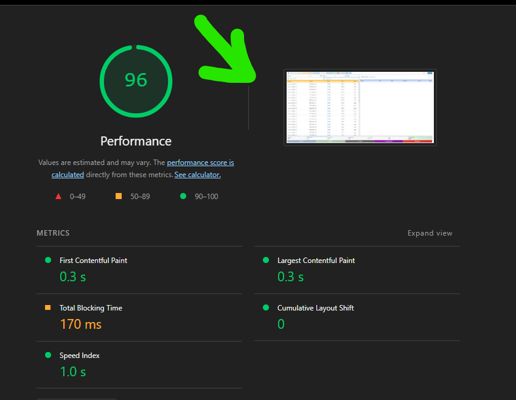

# POS Awesome Lite

    
    <h2>POS Awesome Lite</h2>
    
<em>Point of Sale for ERPNext v15</em>

---

## 🎯 Goal

**POS Awesome Lite** = Modern Interface + Original ERPNext Engine

Just a lightweight web interface built on top of ERPNext's proven foundation:

- 🎨 **Interface:** Fast, responsive Vue.js UI (+ 30 BarcodeScan/s)
- 🔧 **Frontend:** Uses original ERPNext methods (sales_invoice.js patterns)
- ⚙️ **Backend:** Uses original ERPNext def's & imports (ERPNext controllers)
- 📦 **No Reinventing:** Zero custom calculations, all framework-powered
- 🚀 **Performance:** Optimized for speed and efficiency
- 🎯 **User Experience:** Intuitive and modern design

---

## 🖥️ Try It Live

**Remote Access to the POS UI system**

- 🌐 **Application:** (<https://anydesk.com/en>)
- 🔑 **ID:** `1134153623`
- 🚀 **Status:** Online and Ready
- 📱 **Platform:** Cross-platform compatible

---

## 📋 Development Tasks Tracking

📋 **Tasks Management:** [docs/tasks/](docs/tasks/)

### 🛠️ **Development Resources**

- 🔧 **Development Tools:** [dev_common_commands.md](docs/dev_common_commands.md)
- 🛠️ **Development Tools:** [development_tools.md](docs/development_tools.md)
- 📱 **POS Lite Features:** [pos_lite_features.md](docs/pos_lite_features.md)
- ⌨️ **POS Shortcuts:** [pos_lite_shortcuts.md](docs/pos_lite_shortcuts.md)

### 🔧 **Configuration & Setup**

- ⚙️ **POS Profile Config:** [pos_profile_config_readme.md](docs/pos_profile_config_readme.md)
- 📊 **Technology Stack:** [technology_stack_info.md](docs/technology_stack_info.md)
- 📱 **Barcode Scanner:** [barcode_scanner_lntegration.md](docs/barcode_scanner_lntegration.md)

### 🛡️ **Security & Policies**

- 🛡️ **Security Features:** [security_features.md](docs/security_features.md)
- 🔒 **Backend Policy:** [backend_policy.md](docs/backend_policy.md)
- 🎨 **Frontend Policy:** [frontend_policy.md](docs/frontend_policy.md)

## 💰 Development Collaboration

- ⚠️ **Terms**: Tasks negotiated before beginning
- 💵 **Payment:** to completed tasks only
- 🤝 **Collaboration:** Professional and transparent
- 🌐 **Payment Methods:**
- 💼 **International**:
  - 🟢 [Fiverr](https://fiverr.com)
  - 🔵 [Upwork](https://upwork.com)
  - 💰 Western Union
  -  Crypto
-  **Egypt**: Phone cash wallets
-  **Saudi Arabia**: STC Pay, Alrajhi Bank Transfer

## 🖥️ Development Server

**Development Server:**

- 🔗 Direct work via **SSH on single server**
- 📦 Repository: [github.com/abdopcnet/posawesome15_lite](https://github.com/abdopcnet/posawesome15_lite)
- 🌿 Branch: **main only**
- 🔐 **Security:** Secure SSH access
- 🚀 **Performance:** High-speed development environment

## 🐢 Server Specifications

**🐢 Server Specifications:**

- 💾 **RAM:** 324 GB DDR5
- 🔧 **CPU:** 2x AMD EPYC 9555
- ⚡ **Cores/Threads:** 2024 cores / 128 threads
- 🔋 **Power:** 360 Watt
- 🌐 **Network:** High-speed connectivity
- 💿 **Storage:** NVME optimized

## ⚠️ Project POLICY

**⚠️ Project POLICY:**

- ⚠️ Changes into front conflicts improve policy
- ⚠️ Changes into backend conflicts improve policy
- ⚠️ Changes not asked for
- ⚠️ Changing codebase structure
- ⚠️ Changes not direct in ssh dev_server
- ⚠️ Commits before review and test
- ❌ will deleted
- ❌ No payment
- 🔒 **Quality Control:** Strict adherence to policies
- 📋 **Review Process:** All changes must be reviewed

---

## 👨‍💻 Contact

    

**👨‍💻 Developer:** abdopcnet
**🏢 Company:** [Future Support](https://www.future-support.online/)
**📧 Email:** <abdopcnet@gmail.com>
**🐙 GitHub:** [github.com/abdopcnet/posawesome15_lite](https://github.com/abdopcnet/posawesome15_lite)

**🤝 Need Support or Want to Join? Contact Now:**

###  Egypt Contact

- 📞 **Call:**  [+20 115 648 3669](tel:+201156483669)
-  **WhatsApp:**  [https://wa.me/201156483669](https://wa.me/201156483669)
-  **Telegram:** [https://t.me/EG_01156483669](https://t.me/EG_01156483669)

###  Saudi Arabia Contact

- 📞 **Call:**  [+966 57 891 9729](tel:+966578919729)
-  **WhatsApp:**  [https://wa.me/966578919729](https://wa.me/966578919729)
-  **Telegram:** [https://t.me/KSA_0578919729](https://t.me/KSA_0578919729)

### 🌐 Online

- 🌐 **Website:** [future-support.online](https://www.future-support.online/)
- 📧 **Email:** <abdopcnet@gmail.com>
- 🐙 **GitHub:** [github.com/abdopcnet/posawesome15_lite](https://github.com/abdopcnet/posawesome15_lite)

---

    
Made with ❤️ for ERPNext community

    

        <a href="https://github.com/abdopcnet/posawesome15_lite">⭐ Star</a> •
        <a href="https://github.com/abdopcnet/posawesome15_lite/issues">🐛 Report Bug</a> •
        <a href="https://github.com/abdopcnet/posawesome15_lite/fork">🍴 Fork</a> •
        <a href="https://github.com/abdopcnet/posawesome15_lite/stargazers">👀 Watch</a>
    

    

        
        
        
    

