# POSAwesome Application - Architecture Diagrams

**Version:** 18.7.2025  
**Repository:** [https://github.com/abdopcnet/posawesome15_lite](https://github.com/abdopcnet/posawesome15_lite)  
**Date:** October 12, 2025

---

## 📊 System Architecture Overview

```mermaid
graph TB
    subgraph "Client Layer - Browser"
        UI[User Interface]
        Browser[Web Browser]
    end

    subgraph "Frontend Layer - Vue.js 3"
        App[Home.vue - Root Component]
        Navbar[Navbar.vue - Navigation]
        POS[Pos.vue - Main Container]
        
        subgraph "POS Components"
            Items[ItemsSelector.vue]
            Invoice[Invoice.vue - 3,125 lines]
            Payments[Payments.vue]
            Offers[PosOffers.vue]
            Coupons[PosCoupons.vue]
            Customer[Customer.vue]
        end
        
        subgraph "Shared Components"
            OpenDialog[OpeningDialog.vue]
            CloseDialog[ClosingDialog.vue]
            Drafts[Drafts.vue]
            Returns[Returns.vue]
            UpdateCust[UpdateCustomer.vue]
            NewAddr[NewAddress.vue]
        end
        
        EventBus[Event Bus - mitt]
    end

    subgraph "Backend Layer - Frappe/ERPNext"
        subgraph "API Endpoints"
            SalesAPI[sales_invoice.py<br/>697 lines]
            ItemAPI[item.py<br/>256 lines]
            CustomerAPI[customer.py<br/>512 lines]
            OfferAPI[pos_offer.py<br/>519 lines]
            ShiftAPI[pos_opening_shift.py<br/>205 lines]
            ProfileAPI[pos_profile.py]
            BatchAPI[batch.py]
        end
        
        subgraph "Document Hooks"
            ValidateHook[validate hooks]
            SubmitHook[before_submit hooks]
            CancelHook[before_cancel hooks]
            InsertHook[after_insert hooks]
        end
    end

    subgraph "Database Layer - MariaDB"
        subgraph "ERPNext Core"
            SITable[Sales Invoice]
            ItemTable[Item]
            CustomerTable[Customer]
            ItemPrice[Item Price]
            Batch[Batch]
        end
        
        subgraph "POS Custom"
            POSOffer[POS Offer]
            POSCoupon[POS Coupon]
            POSProfile[POS Profile]
            POSOpen[POS Opening Shift]
            POSClose[POS Closing Shift]
            Referral[Referral Code]
        end
    end

    %% Connections
    UI --> Browser
    Browser --> App
    App --> Navbar
    App --> POS
    
    POS --> Items
    POS --> Invoice
    POS --> Payments
    POS --> Offers
    POS --> Coupons
    
    Invoice --> Customer
    POS --> OpenDialog
    POS --> CloseDialog
    POS --> Drafts
    POS --> Returns
    Customer --> UpdateCust
    Customer --> NewAddr
    
    Items -.-> EventBus
    Invoice -.-> EventBus
    Payments -.-> EventBus
    Offers -.-> EventBus
    Coupons -.-> EventBus
    Customer -.-> EventBus
    
    EventBus ==> SalesAPI
    EventBus ==> ItemAPI
    EventBus ==> CustomerAPI
    EventBus ==> OfferAPI
    EventBus ==> ShiftAPI
    EventBus ==> ProfileAPI
    EventBus ==> BatchAPI
    
    SalesAPI --> ValidateHook
    SalesAPI --> SubmitHook
    SalesAPI --> CancelHook
    CustomerAPI --> ValidateHook
    CustomerAPI --> InsertHook
    
    SalesAPI --> SITable
    ItemAPI --> ItemTable
    ItemAPI --> ItemPrice
    ItemAPI --> Batch
    CustomerAPI --> CustomerTable
    OfferAPI --> POSOffer
    ShiftAPI --> POSOpen
    ShiftAPI --> POSClose
    CustomerAPI --> Referral
    
    %% Styling
    classDef frontend fill:#e1f5fe,stroke:#01579b,stroke-width:2px
    classDef backend fill:#f3e5f5,stroke:#4a148c,stroke-width:2px
    classDef database fill:#e8f5e9,stroke:#1b5e20,stroke-width:2px
    classDef event fill:#fff3e0,stroke:#e65100,stroke-width:2px
    classDef critical fill:#ffebee,stroke:#c62828,stroke-width:3px
    
    class App,Navbar,POS,Items,Invoice,Payments,Offers,Coupons,Customer frontend
    class OpenDialog,CloseDialog,Drafts,Returns,UpdateCust,NewAddr frontend
    class SalesAPI,ItemAPI,CustomerAPI,OfferAPI,ShiftAPI,ProfileAPI,BatchAPI backend
    class ValidateHook,SubmitHook,CancelHook,InsertHook backend
    class SITable,ItemTable,CustomerTable,ItemPrice,Batch database
    class POSOffer,POSCoupon,POSProfile,POSOpen,POSClose,Referral database
    class EventBus event
    class Invoice critical
```

---

## 🔄 Component Communication Flow

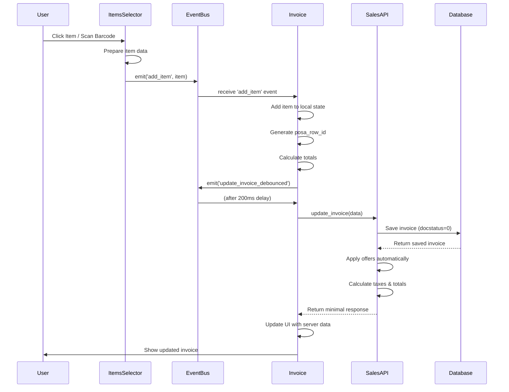

---

## 📦 Data Flow Architecture

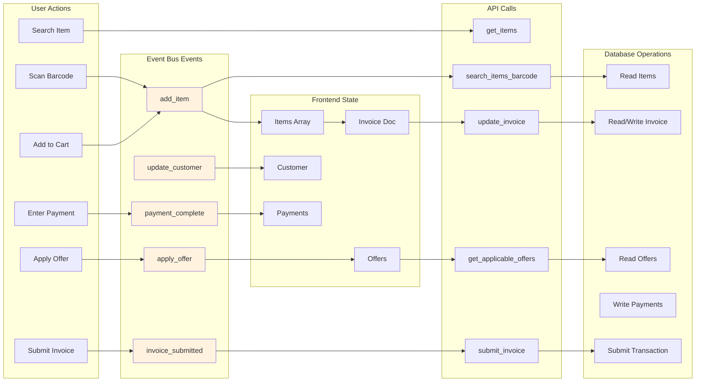

---

## 🎯 POS Checkout Workflow

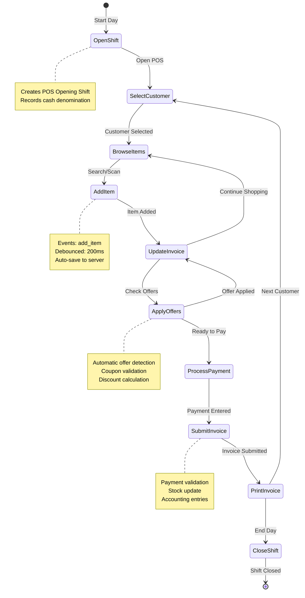

---

## 🗄️ Database Schema Relationships

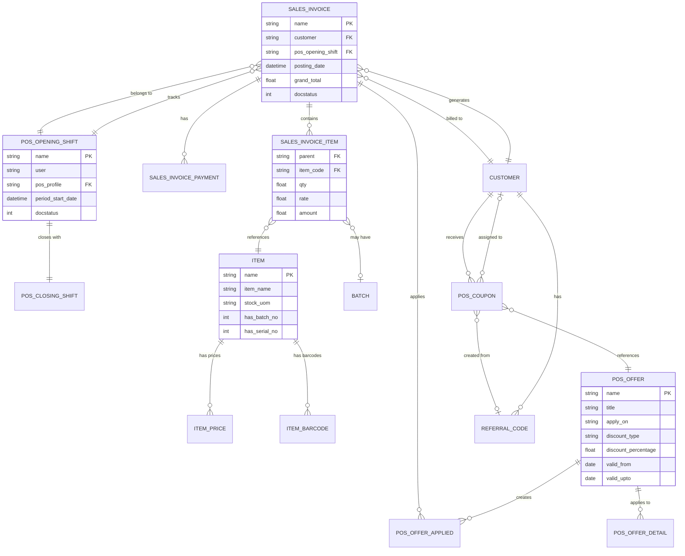

---

## 🔐 Security & Permission Flow

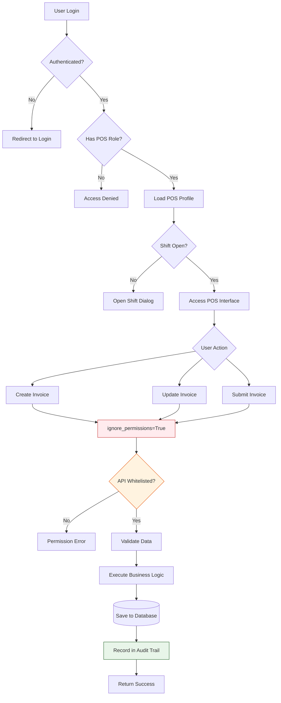

---

## 🎨 Frontend Component Tree

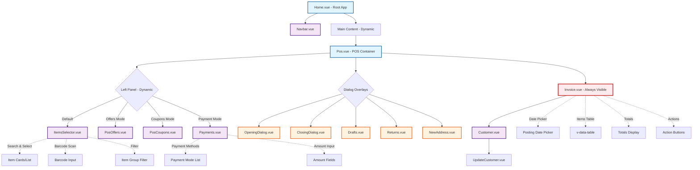

---

## 📡 Event Bus Architecture

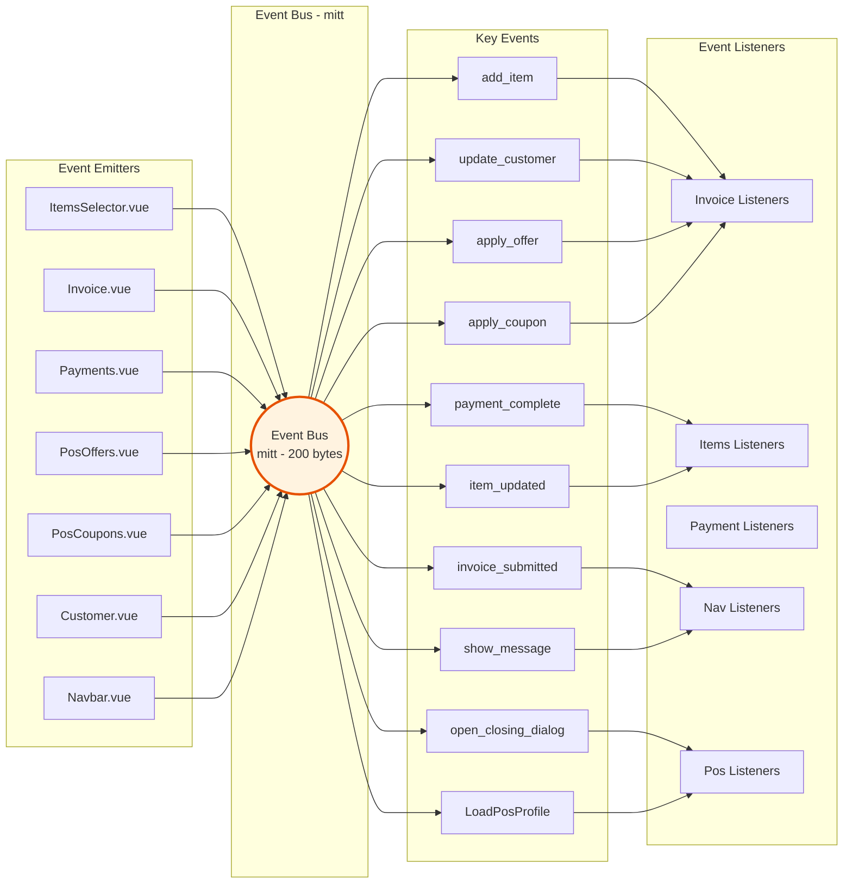

---

## 🔧 API Request/Response Flow

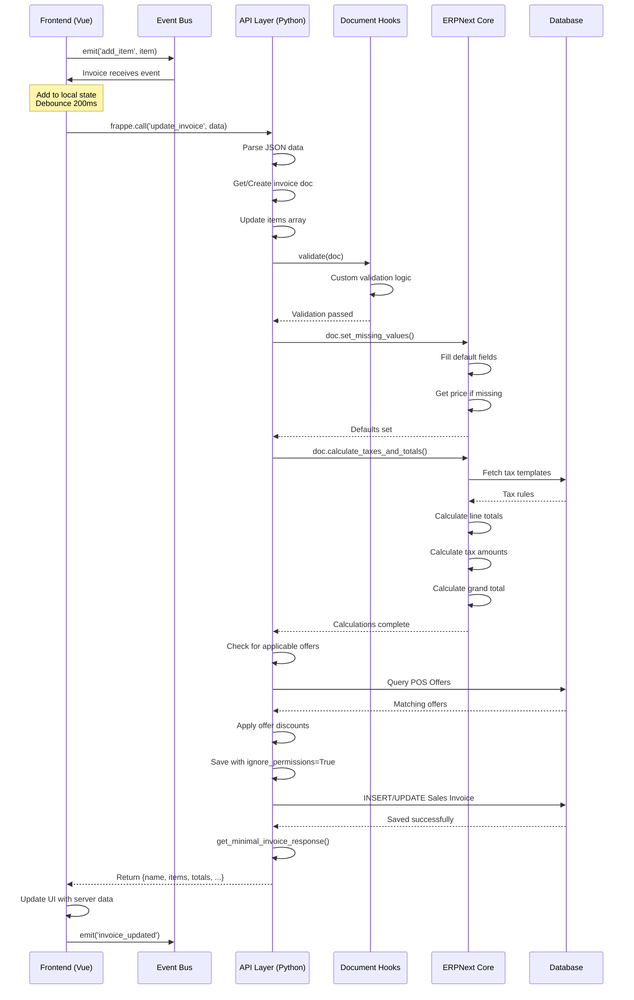

---

## 🚀 Performance Optimization Points

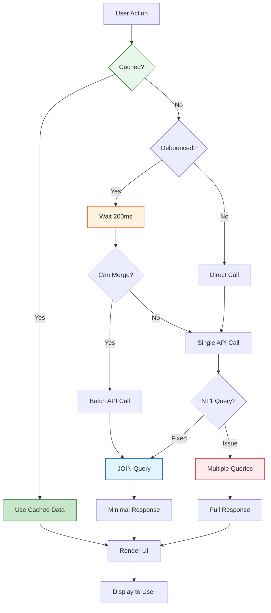

---

## 📊 Invoice State Machine

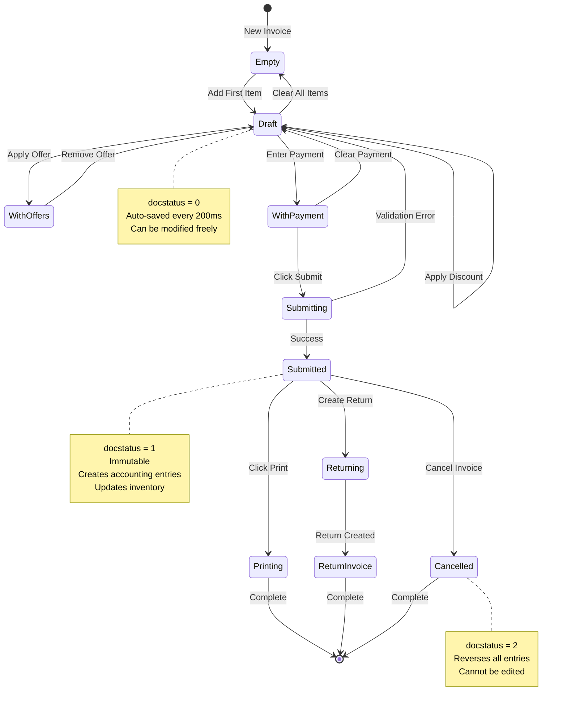

---

## 🎯 Critical Performance Issues

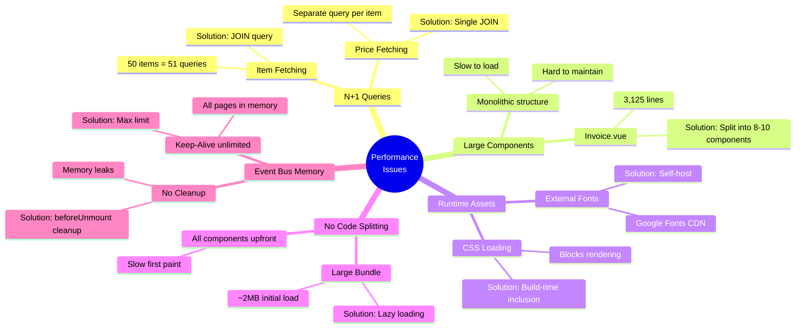

---

## 📈 Recommended Architecture Improvements

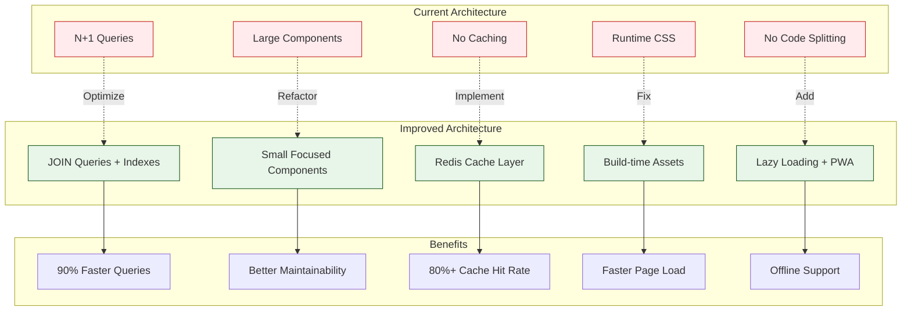

---

## 📝 Notes

### How to View These Diagrams

1. **VS Code**: Install the "Markdown Preview Mermaid Support" extension
   ```
   Extension ID: bierner.markdown-mermaid
   ```

2. **GitHub**: Diagrams render automatically when viewing on GitHub

3. **Online**: Copy diagrams to [mermaid.live](https://mermaid.live) for editing

### Diagram Legend

- **Blue boxes**: Frontend components (Vue.js)
- **Purple boxes**: Backend components (Python/Frappe)
- **Green boxes**: Database tables (MariaDB)
- **Orange boxes**: Event-driven components
- **Red boxes**: Critical/Large components needing attention

### Related Documentation

- [Complete Analysis](./posawesome_comprehensive_analysis.md)
- [Improvement Plan](./IMPROVEMENT_PLAN.md)
- [File Structure](./app_tree.md)
- [README](./README.md)

---

**Last Updated:** October 12, 2025  
**Maintained By:** abdopcnet@gmail.com  
**Repository:** [https://github.com/abdopcnet/posawesome15_lite](https://github.com/abdopcnet/posawesome15_lite)
