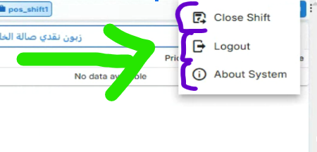

# Customize Main Menu CSS

## 📋 Overview
Allow users to customize the visual appearance of the main menu through CSS styling options.

## 🎯 CSS Customization Features
- **Menu Colors** - Change background and text colors
- **Menu Layout** - Adjust spacing, padding, margins
- **Menu Icons** - Customize icon size and style
- **Menu Fonts** - Change font family, size, weight
- **Menu Effects** - Add hover effects, transitions

## 🖼️ Visual Reference

## 🔧 Implementation
- **CSS Variables** - Use CSS custom properties for theming
- **Style Panel** - Simple CSS editor interface
- **Live Preview** - See changes instantly
- **Preset Themes** - Pre-built color schemes

## 📋 Success Criteria
- [ ] Users can change menu colors
- [ ] Menu layout can be adjusted
- [ ] Icon styling can be customized
- [ ] Font changes apply correctly
- [ ] Hover effects work properly

---
**Priority**: Low  
**Status**: Requested
