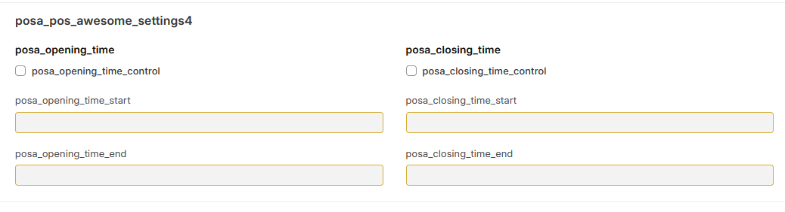

# POS Opening & Closing Shift Timer Control

## Overview
This document describes the timer-based control system for POS opening and closing shifts, ensuring users can only open/close shifts within allowed time periods as defined in the POS profile settings.

## 🖼️ Visual Reference


## 🕐 Timer Control System

### **Opening Shift Timer**
- **Purpose**: Control when users can open a new POS shift
- **Configuration**: Based on POS profile "Open Control Timer" field
- **Behavior**: Users can only open shifts within allowed time periods
- **Validation**: Real-time checking against allowed time windows

### **Closing Shift Timer**
- **Purpose**: Control when users can close an active POS shift
- **Configuration**: Based on POS profile "Close Control Timer" field
- **Behavior**: Users can only close shifts within allowed time periods
- **Validation**: Real-time checking against allowed time windows

## ⚙️ POS Profile Configuration

### **Timer Fields**
1. **Open Control Timer**
   - Defines allowed opening time periods
   - Multiple time windows supported
   - Format: `HH:MM-HH:MM,HH:MM-HH:MM`
   - Example: `08:00-12:00,14:00-18:00`

2. **Close Control Timer**
   - Defines allowed closing time periods
   - Multiple time windows supported
   - Format: `HH:MM-HH:MM,HH:MM-HH:MM`
   - Example: `10:00-14:00,16:00-20:00`

### **Configuration Examples**
```json
{
  "pos_profile": "Main Counter",
  "open_control_timer": "08:00-12:00,14:00-18:00",
  "close_control_timer": "10:00-14:00,16:00-20:00",
  "timezone": "Asia/Riyadh"
}
```

## 🎯 Time Period Validation

### **Opening Shift Validation**
- **Current Time Check**: Validate current time against allowed periods
- **Multiple Windows**: Support for multiple allowed time periods
- **Timezone Support**: Handle different timezone configurations
- **Real-time Validation**: Check time before allowing shift opening

### **Closing Shift Validation**
- **Current Time Check**: Validate current time against allowed periods
- **Active Shift Check**: Ensure there's an active shift to close
- **Multiple Windows**: Support for multiple allowed time periods
- **Timezone Support**: Handle different timezone configurations

## 🔧 Technical Implementation

### **API Endpoints**
```
POST /api/method/posawesome.posawesome.api.pos_opening_shift_timer.validate_opening_time
POST /api/method/posawesome.posawesome.api.pos_closing_shift_timer.validate_closing_time
```

### **Opening Timer Validation**
```python
def validate_opening_time(pos_profile, current_time):
    """
    Validate if current time is within allowed opening periods
    """
    allowed_periods = pos_profile.open_control_timer
    return check_time_in_periods(current_time, allowed_periods)
```

### **Closing Timer Validation**
```python
def validate_closing_time(pos_profile, current_time):
    """
    Validate if current time is within allowed closing periods
    """
    allowed_periods = pos_profile.close_control_timer
    return check_time_in_periods(current_time, allowed_periods)
```

## 📱 User Interface Behavior

### **Opening Shift Dialog**
- **Time Display**: Show current time and allowed periods
- **Status Indicator**: Green (allowed) / Red (not allowed)
- **Error Messages**: Clear explanation when opening not allowed
- **Countdown Timer**: Show time until next allowed period

### **Closing Shift Dialog**
- **Time Display**: Show current time and allowed periods
- **Status Indicator**: Green (allowed) / Red (not allowed)
- **Error Messages**: Clear explanation when closing not allowed
- **Countdown Timer**: Show time until next allowed period

## 🚨 Error Handling

### **Opening Shift Errors**
- **Outside Allowed Time**: "Shift opening not allowed at this time"
- **No Active Period**: "No opening periods configured for this profile"
- **Invalid Configuration**: "Invalid timer configuration in POS profile"
- **Timezone Issues**: "Timezone configuration error"

### **Closing Shift Errors**
- **Outside Allowed Time**: "Shift closing not allowed at this time"
- **No Active Period**: "No closing periods configured for this profile"
- **No Active Shift**: "No active shift to close"
- **Invalid Configuration**: "Invalid timer configuration in POS profile"

## 📊 Time Period Examples

### **Business Hours Configuration**
```
Open Control Timer: 08:00-12:00,14:00-18:00
Close Control Timer: 10:00-14:00,16:00-20:00

Allowed Opening Times:
- Morning: 08:00 AM - 12:00 PM
- Afternoon: 02:00 PM - 06:00 PM

Allowed Closing Times:
- Morning: 10:00 AM - 02:00 PM
- Afternoon: 04:00 PM - 08:00 PM
```

### **24/7 Configuration**
```
Open Control Timer: 00:00-23:59
Close Control Timer: 00:00-23:59

Allowed Times: Always (24/7)
```

### **Limited Hours Configuration**
```
Open Control Timer: 09:00-17:00
Close Control Timer: 09:00-17:00

Allowed Times: 09:00 AM - 05:00 PM only
```

## 🔒 Security & Validation

### **Server-Side Validation**
- **Time Validation**: Server validates all time checks
- **Profile Validation**: Ensure POS profile exists and is active
- **Permission Checks**: Verify user has shift management permissions
- **Audit Logging**: Log all shift opening/closing attempts

### **Client-Side Validation**
- **Real-time Checks**: Immediate feedback to user
- **Time Synchronization**: Sync with server time
- **Caching**: Cache allowed periods for performance
- **Error Prevention**: Prevent invalid submissions

## 📈 Performance Considerations

### **Optimization Features**
- **Caching**: Cache allowed time periods
- **Pre-calculation**: Calculate next allowed periods
- **Efficient Parsing**: Fast time period parsing
- **Minimal API Calls**: Reduce server requests

### **Performance Metrics**
- **Validation Speed**: <50ms response time
- **Cache Hit Rate**: >90% cache hits
- **API Calls**: Minimal server requests
- **User Experience**: Instant feedback

## 🎯 Business Rules

### **Opening Shift Rules**
1. **Time Validation**: Must be within allowed opening periods
2. **Profile Check**: POS profile must be active
3. **User Permissions**: User must have opening permissions
4. **No Active Shift**: Cannot open if shift already active

### **Closing Shift Rules**
1. **Time Validation**: Must be within allowed closing periods
2. **Active Shift**: Must have an active shift to close
3. **User Permissions**: User must have closing permissions
4. **Profile Check**: POS profile must be active

## 🚀 Future Enhancements

### **Planned Features**
- **Holiday Support**: Special rules for holidays
- **Shift Overlap**: Allow shift overlap periods
- **Automatic Closing**: Auto-close shifts at end of period
- **Notification System**: Alerts for shift time windows
- **Mobile App Support**: Mobile-specific timer controls

### **Advanced Features**
- **Dynamic Periods**: Time periods based on business rules
- **Multi-location**: Different rules per location
- **Role-based**: Different rules per user role
- **Integration**: Integration with attendance systems

## 📋 Usage Scenarios

### **Scenario 1: Morning Opening**
```
Current Time: 09:30 AM
Open Control Timer: 08:00-12:00,14:00-18:00
Result: ✅ Opening Allowed
```

### **Scenario 2: Lunch Break**
```
Current Time: 01:00 PM
Open Control Timer: 08:00-12:00,14:00-18:00
Result: ❌ Opening Not Allowed (outside allowed periods)
```

### **Scenario 3: Evening Closing**
```
Current Time: 05:30 PM
Close Control Timer: 10:00-14:00,16:00-20:00
Result: ✅ Closing Allowed
```

## 🎯 Success Criteria

### **Functional Requirements**
- **Time Accuracy**: 100% accurate time validation
- **Multi-period Support**: Support multiple time windows
- **Timezone Handling**: Proper timezone support
- **Error Handling**: Clear error messages

### **Performance Requirements**
- **Response Time**: <50ms validation time
- **Reliability**: 99.9% uptime
- **User Experience**: Intuitive interface
- **Scalability**: Support multiple concurrent users

---

**Last Updated:** 2025-01-16  
**Version:** 1.0  
**Status:** Active
