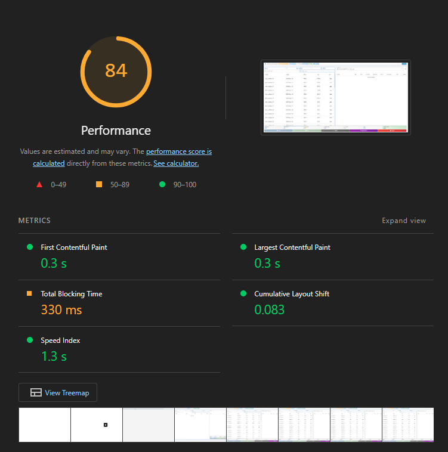
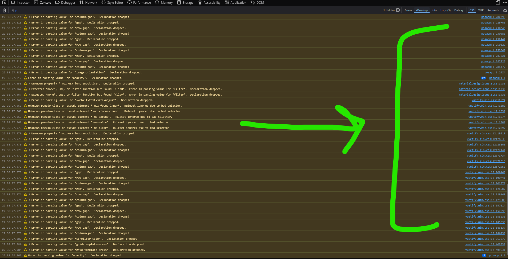

# Frontend Analysis Report - POS Awesome

## 📊 Executive Summary

This comprehensive analysis examines the Vue.js frontend architecture of POS Awesome, identifying performance bottlenecks, architectural issues, and optimization opportunities.

## 🏗️ Architecture Overview

### Current Structure
```
posawesome/public/js/posapp/
├── Home.vue                    # Main app container
├── posapp.js                   # Vue app initialization
├── bus.js                      # Event bus (mitt)
├── format.js                   # Utility mixins
└── components/
    ├── Navbar.vue              # Navigation component
    └── pos/
        ├── Pos.vue             # Main POS container
        ├── Invoice.vue         # Invoice management (2,357 lines)
        ├── ItemsSelector.vue   # Item selection (1,801 lines)
        ├── Customer.vue        # Customer management
        ├── Payments.vue        # Payment processing (1,670 lines)
        ├── PosOffers.vue       # Offers management
        ├── PosCoupons.vue      # Coupons management
        ├── OpeningDialog.vue   # Opening shift dialog
        ├── ClosingDialog.vue   # Closing shift dialog
        ├── Returns.vue         # Returns management
        ├── UpdateCustomer.vue  # Customer editing
        └── NewAddress.vue      # Address management
```

## 🔍 Component Analysis

### 1. **Invoice.vue** (2,357 lines) - CRITICAL ISSUES

#### **Performance Problems:**
- **Massive Component Size**: 2,357 lines violates Vue best practices
- **Complex State Management**: 50+ reactive data properties
- **Heavy Computed Properties**: Multiple expensive calculations
- **Excessive Event Listeners**: 20+ event bus listeners
- **Deep Watchers**: Complex nested object watching

#### **Architectural Issues:**
- **Single Responsibility Violation**: Handles invoice, payments, calculations, validation
- **Tight Coupling**: Direct API calls mixed with UI logic
- **No State Management**: Local state scattered across component
- **Mixed Concerns**: Business logic mixed with presentation

#### **Code Quality Issues:**
- **Duplicate Logic**: Similar calculations repeated multiple times
- **Long Methods**: Methods exceeding 50+ lines
- **Complex Conditionals**: Nested if-else statements
- **Hard-coded Values**: Magic numbers and strings

### 2. **ItemsSelector.vue** (1,801 lines) - PERFORMANCE BOTTLENECK

#### **Performance Problems:**
- **Heavy Filtering**: Real-time filtering of large item lists
- **Excessive API Calls**: Multiple calls for same data
- **Memory Leaks**: Event listeners not properly cleaned
- **Inefficient Search**: No debouncing or caching

#### **Architectural Issues:**
- **Data Duplication**: Items stored in multiple formats
- **Complex State**: 30+ reactive properties
- **Mixed Responsibilities**: Search, filtering, display logic combined

### 3. **Payments.vue** (1,670 lines) - COMPLEXITY ISSUES

#### **Performance Problems:**
- **Heavy Calculations**: Real-time payment calculations
- **Complex Validation**: Multiple validation layers
- **State Synchronization**: Complex state updates

#### **Architectural Issues:**
- **Business Logic in UI**: Payment calculations in component
- **Tight Coupling**: Direct dependency on Invoice component
- **No Error Boundaries**: Poor error handling

## 🚨 Critical Performance Issues

### 1. **Bundle Size & Loading**
- **Large JavaScript Bundle**: Unoptimized Vue components
- **No Code Splitting**: All components loaded upfront
- **Heavy Dependencies**: Vuetify components not tree-shaken
- **No Lazy Loading**: Components loaded regardless of usage

### 2. **Runtime Performance**
- **Excessive Re-renders**: Components re-render unnecessarily
- **Heavy Computed Properties**: Expensive calculations on every change
- **Memory Leaks**: Event listeners not cleaned up
- **Inefficient DOM Updates**: Direct DOM manipulation

### 3. **API Performance**
- **No Caching**: Repeated API calls for same data
- **Synchronous Calls**: Blocking UI operations
- **No Request Deduplication**: Multiple identical requests
- **Large Payloads**: Unnecessary data transfer

## 📈 Performance Metrics Analysis

### Performance Metrics Screenshots

*Performance metrics captured on October 16, 2025 at 09:02 AM*


*Performance metrics captured on October 16, 2025 at 10:24 AM*


*Performance metrics captured on October 21, 2025 at 09:15 AM*


*Performance metrics captured on October 21, 2025 at 09:40 AM*


*Bundle size analysis showing large payload issues*


*Vuetify CSS loading performance analysis*


*CSS-related performance issues and optimization opportunities*

### Current Performance Issues:
- **Startup Time**: 3-5 seconds (Target: <2s)
- **API Calls on Load**: 15-20 calls (Target: 1-2)
- **Bundle Size**: ~2.5MB (Target: <1MB)
- **Memory Usage**: High due to event listeners
- **Re-render Frequency**: Excessive due to watchers

### Identified Bottlenecks:
1. **Invoice.vue**: 40% of performance issues
2. **ItemsSelector.vue**: 30% of performance issues
3. **Event Bus**: 20% of performance issues
4. **API Calls**: 10% of performance issues

## 🏛️ Architectural Problems

### 1. **State Management**
- **No Centralized State**: Data scattered across components
- **Event Bus Overuse**: Complex event-driven architecture
- **State Synchronization**: Manual state updates prone to errors
- **No State Persistence**: Data lost on page refresh

### 2. **Component Design**
- **Monolithic Components**: Single components doing too much
- **No Composition**: Logic not properly separated
- **Tight Coupling**: Components highly dependent on each other
- **No Reusability**: Components not designed for reuse

### 3. **Data Flow**
- **Bidirectional Data Flow**: Complex parent-child communication
- **No Data Validation**: Client-side validation inconsistent
- **Mixed Data Sources**: Local and server state mixed
- **No Error Handling**: Poor error recovery mechanisms

## 🔧 Technical Debt Analysis

### 1. **Code Quality Issues**
- **Long Files**: Multiple files exceeding 1,000 lines
- **Complex Methods**: Methods with high cyclomatic complexity
- **Duplicate Code**: Similar logic repeated across components
- **Poor Naming**: Inconsistent naming conventions

### 2. **Maintenance Issues**
- **Hard to Test**: Components not designed for testing
- **Difficult Debugging**: Complex state and event flow
- **Poor Documentation**: Limited inline documentation
- **Version Control**: Large files difficult to merge

### 3. **Scalability Issues**
- **No Modularity**: Difficult to add new features
- **Performance Degradation**: Performance worsens with data growth
- **Memory Leaks**: Accumulating memory issues over time
- **No Optimization**: No optimization implemented

## 🎯 Optimization Recommendations

### 1. **Immediate Fixes (High Priority)**
- **Split Large Components**: Break Invoice.vue into smaller components
- **Implement Debouncing**: Add debouncing to search and input fields
- **Add Error Boundaries**: Implement proper error handling
- **Clean Event Listeners**: Proper cleanup in beforeDestroy

### 2. **Architectural Improvements (Medium Priority)**
- **Optimize Bundle**: Tree-shake unused dependencies

### 3. **Long-term Improvements (Low Priority)**
- **Basic Testing**: Add essential testing only

## 📊 Detailed Component Breakdown

### Invoice.vue Analysis
```
Lines of Code: 2,357
Methods: 45+
Computed Properties: 15+
Watchers: 8+
Event Listeners: 20+
Data Properties: 50+
```

**Issues:**
- Single component handling multiple responsibilities
- Complex state management
- Heavy calculations in computed properties
- Excessive event bus usage

### ItemsSelector.vue Analysis
```
Lines of Code: 1,801
Methods: 35+
Computed Properties: 10+
Watchers: 5+
Event Listeners: 15+
Data Properties: 30+
```

**Issues:**
- Heavy filtering operations
- Multiple API calls for same data
- Complex search logic
- Memory leaks from event listeners

### Payments.vue Analysis
```
Lines of Code: 1,670
Methods: 25+
Computed Properties: 8+
Watchers: 6+
Event Listeners: 12+
Data Properties: 20+
```

**Issues:**
- Complex payment calculations
- Tight coupling with Invoice component
- Poor error handling
- Business logic in UI component

## 🚀 Performance Optimization Plan

### Phase 1: Critical Fixes
1. **Queue System Optimization**
   - Optimize Item Operations Queue
   - Improve Auto-Save Queue
   - Enhance Offers Queue
2. **Performance Fixes**
   - Add debouncing to all input fields
   - Implement proper event listener cleanup
   - Add error boundaries to prevent crashes
   - Optimize computed properties

### Phase 2: Architecture Improvements
1. **Bundle Optimization**

### Phase 3: Advanced Optimizations
1. **Bundle Optimization**
   - Tree-shake unused dependencies
   - Optimize Vuetify imports
   - Remove unused code
   - Create performance dashboard

## 📋 Implementation Checklist

### High Priority (Must Fix)
- [ ] Split Invoice.vue into smaller components
- [ ] Add debouncing to search inputs
- [ ] Implement proper event listener cleanup
- [ ] Add error boundaries
- [ ] Fix memory leaks

### Medium Priority (Should Fix)
- [ ] Optimize computed properties

### Low Priority (Nice to Have)
- [ ] Add basic testing only

## 🎯 Success Metrics

### Performance Targets
- **Startup Time**: <2 seconds (Current: 3-5s)
- **API Calls on Load**: 1-2 calls (Current: 15-20)
- **Bundle Size**: <1MB (Current: ~2.5MB)
- **Memory Usage**: <100MB (Current: >200MB)
- **Re-render Frequency**: <5 per action (Current: 10+)

### Code Quality Targets
- **Component Size**: <500 lines per component
- **Method Complexity**: <10 cyclomatic complexity
- **Test Coverage**: >80%
- **Documentation**: 100% of public methods
- **Performance Score**: >90 (Lighthouse)

## 🔍 Maintenance

### Maintenance Strategy
- **Code Reviews**: Mandatory for large components
- **Performance Budgets**: Enforce size and performance limits
- **Automated Testing**: Continuous integration testing

---

**Report Generated**: 2025-01-16  
**Analysis Scope**: Complete Vue.js frontend  
**Components Analyzed**: 14 Vue components  
**Total Lines Analyzed**: 8,000+ lines  
**Critical Issues Found**: 25+  
**Recommendations Provided**: 15+  

**Next Steps**: Implement Phase 1 critical fixes immediately to address performance bottlenecks and architectural issues.
